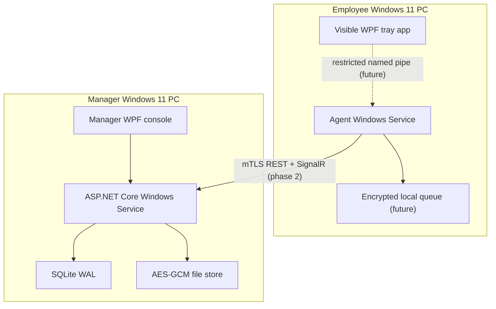
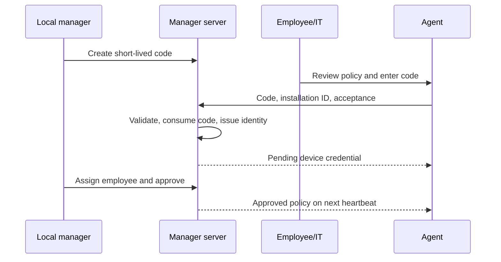

# Architecture

## Component view

Solid connections exist in the v0.1 foundation. Dotted/future-labeled connections are design commitments, not current claims.

## Enrollment flow

In v0.1 the issued credential is a 256-bit bearer token hashed at rest. Phase 2 replaces it with a client certificate, mTLS, rotation and revocation before the server is exposed beyond loopback.

## Activity classification

- The input sampler will produce counts and last-input timestamps in 60-second UTC buckets.
- No key value or mouse-button value is represented in any contract or entity.
- Signed-out, locked and approved-break states take precedence.
- Incomplete evidence yields `Unknown`.
- When continuous inactivity reaches the threshold, the inactivity window is idle; it is not retroactively credited as active.
- A 60-second bucket containing the most recent input event remains active. Once the threshold is reached, every completed bucket that begins after that event is finalized as idle. Before the threshold, those buckets are provisional; reports round only to whole bucket boundaries.
- Schedule boundaries are start-inclusive and end-exclusive. Conversion begins from UTC instants to handle ambiguous daylight-saving times deterministically.

## Trust boundaries

1. Interactive employee session ↔ privileged service: separate integrity levels; restricted named pipe is required before native sampling/capture.
2. Employee device ↔ LAN ↔ manager server: untrusted network; mTLS and replay defenses are required.
3. Manager UI ↔ server: privileged actions; Windows identity plus MFA/Hello and RBAC are required.
4. Server ↔ database/file store: local disk; AES-GCM data keys must be DPAPI-wrapped and ACL-restricted.
5. Release pipeline ↔ device update: untrusted distribution; Authenticode signature and package hash verification are required.

## Storage

SQLite uses WAL, foreign keys, a five-second busy timeout, uniqueness constraints for idempotency, and retention indexes. Screenshot assets use server-generated partitioned paths; a caller can never supply an absolute storage path. File payload format is version byte, 96-bit nonce, 128-bit tag, then AES-256-GCM ciphertext.
